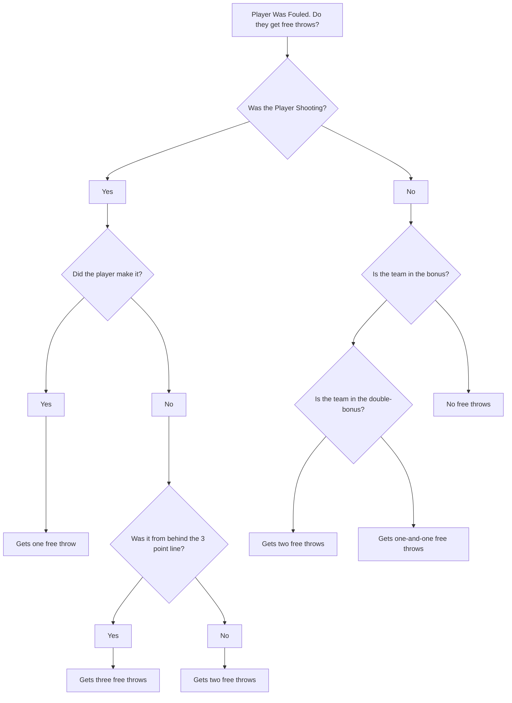

```mermaid
flowchart TD
  A[Player Was Fouled. Do they get free throws?]
  A -->fouled{Was the Player Shooting?}
  fouled --> shooting[Yes]
  fouled --> not-shooting[No]
  shooting --> make-it{Did the player make it?}
  make-it --> made-it[Yes]
  make-it --> missed-it[No]
  made-it --> shot[Gets one free throw]
  missed-it --> three{Was it from behind the 3 point line?}
  three --> yes-three[Yes]
  three --> no-three[No]
  yes-three --> three-shots[Gets three free throws]
  no-three --> two-shots[Gets two free throws]
  not-shooting --> bonus{Is the team in the bonus?}
  bonus --> yes-bonus{Is the team in the double-bonus?}
  yes-bonus --> yes-double-bonus[Gets two free throws]
  yes-bonus --> no-double-bonus[Gets one-and-one free throws]
  bonus --> no-bonus[No free throws]
```
